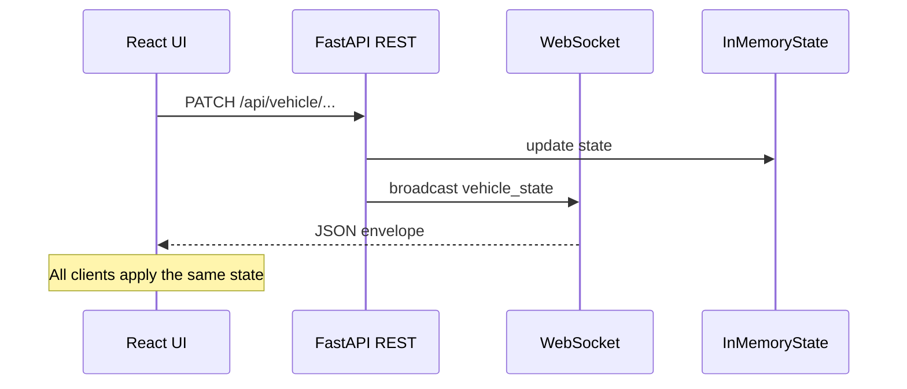

# Spectra

**Jarvis-style 3D vehicle visualization** — a split-hosted app with a React + Three.js frontend and a FastAPI backend. The UI drives vehicle lighting and paint through REST; every mutation is broadcast over WebSockets so all open tabs stay in sync with a shared in-memory state.

## Features

- **Interactive 3D stage** — GLB vehicle loaded with React Three Fiber, cinematic lighting, tone mapping, orbit controls, and idle auto-rotate after periods without interaction.
- **Live control panel** — Headlights, brake lights, and paint selection (or cycle) with a neon / glass-morphism aesthetic.
- **Real-time sync** — WebSocket channel pushes `{ type: "vehicle_state", data: ... }` after each successful REST update; reconnect with exponential backoff.
- **Split deployment ready** — Frontend static build talks to a separate API origin via `VITE_API_BASE_URL` and `VITE_WS_URL`; CORS configured on the backend.

## Architecture



| Layer        | Role |
| ------------ | ---- |
| **Frontend** | Vite + React 18 + TypeScript; `@react-three/fiber` + `@react-three/drei` + `three` for the scene. |
| **Backend**  | FastAPI + Uvicorn; in-memory `VehicleStore`; connection manager for WebSocket fan-out. |

## Repository layout

```text
Spectra/
├── frontend/                 # Vite React app
│   ├── .env.example          # VITE_API_BASE_URL, VITE_WS_URL
│   ├── public/models/         # Vehicle GLB + optional manifest JSON
│   └── src/
│       ├── api/              # REST client (vehicleClient.ts)
│       ├── hooks/            # useVehicleChannel (WebSocket)
│       ├── components/       # JarvisShell, VehicleStage, ControlPanel, …
│       ├── scene/            # VehicleModel, lighting, controls, vehicleBindings
│       └── types/            # VehicleState (keep in sync with backend schemas)
├── backend/
│   ├── .env.example          # CORS_ORIGINS
│   ├── requirements.txt      # runtime deps
│   ├── requirements-dev.txt  # GLB inspection (pygltflib)
│   ├── scripts/inspect_glb.py
│   └── app/                  # FastAPI app, state, schemas, WebSocket manager
└── cursor/Plan/scope.md      # Original design notes (checklist, risks)
```

## Prerequisites

- **Node.js** 18+ (recommended) and **npm**
- **Python** 3.11+ (or any version supported by your FastAPI/Pydantic stack)
- **Vehicle asset** — Place the GLB referenced by your manifest under `frontend/public/models/`. The checked-in manifest expects `2021_bmw_430i_xdrive_coupe_4-series.glb` (see `frontend/public/models/bmw_430i.manifest.json`). The sample `.glb` may not be in the repo; add it locally for a full run.

## Quick start (local)

Run **two** processes — this matches split production hosting.

### 1. Backend

```bash
cd backend
python -m venv .venv
source .venv/bin/activate   # Windows: .venv\Scripts\activate
pip install -r requirements.txt
cp .env.example .env        # optional; defaults often work for localhost
uvicorn app.main:app --reload --host 0.0.0.0 --port 8000
```

Health check: `GET http://localhost:8000/api/health` → `{ "status": "ok" }`.

### 2. Frontend

```bash
cd frontend
cp .env.example .env        # ensures VITE_* vars for local API
npm install
npm run dev
```

Open the URL Vite prints (default **http://localhost:5173**). The app needs both `VITE_API_BASE_URL` and `VITE_WS_URL` set; otherwise the REST client or WebSocket hook will error at runtime.

### npm scripts (frontend)

| Command | Description |
| ------- | ----------- |
| `npm run dev` | Vite dev server |
| `npm run build` | Typecheck + production bundle |
| `npm run preview` | Serve the production build locally |
| `npm run typecheck` | `tsc --noEmit` only |

## Configuration

### Frontend (`frontend/.env`)

| Variable | Description |
| -------- | ----------- |
| `VITE_API_BASE_URL` | REST origin, **no trailing slash** (e.g. `http://localhost:8000`). Required at build time for Vite. |
| `VITE_WS_URL` | Full WebSocket URL including path (e.g. `ws://localhost:8000/ws/vehicle`). Use `wss://` when the page is served over HTTPS. |

Copy from `frontend/.env.example`. After changing these for production, **rebuild** the frontend so values are embedded in the bundle.

### Backend (`backend/.env` or shell env)

| Variable | Description |
| -------- | ----------- |
| `CORS_ORIGINS` | Comma-separated browser origins allowed for REST and related checks (e.g. `http://localhost:5173,http://127.0.0.1:5173`). Default in code: `http://localhost:5173`. |

Copy from `backend/.env.example`.

### Single-worker requirement

Vehicle state is **in-memory**. Use **one** Uvicorn worker (or one replica without a shared store). Multiple workers or replicas each hold separate state unless you replace the store with Redis or similar and synchronize broadcasts.

## HTTP API

Base URL: your API origin + paths below (e.g. `http://localhost:8000`).

| Method | Path | Description |
| ------ | ---- | ----------- |
| `GET` | `/api/health` | Liveness / monitoring |
| `GET` | `/api/vehicle` | Current `VehicleState` |
| `PATCH` | `/api/vehicle/headlights` | Body: `{ "on": boolean }` |
| `PATCH` | `/api/vehicle/brake-lights` | Body: `{ "on": boolean }` |
| `PATCH` | `/api/vehicle/paint` | Body: `{ "index": number }` — index must be within the backend paint palette range (currently `0..3`, four colors) |
| `POST` | `/api/vehicle/paint/cycle` | Advance paint index modulo palette length |

Successful mutating responses return the updated `VehicleState` and trigger a WebSocket broadcast.

### `VehicleState` shape

```json
{
  "headlights_on": false,
  "brake_lights_on": false,
  "paint_index": 0
}
```

Frontend TypeScript mirrors this in `frontend/src/types/vehicle.ts`; backend models live in `backend/app/schemas.py`.

## WebSocket

- **URL:** `/ws/vehicle` on the API host (e.g. `ws://localhost:8000/ws/vehicle`).
- **Server behavior:** On connect, the server sends the current state as JSON; clients may send text (e.g. keep-alive pings); disconnect is handled gracefully.
- **Message envelope:**

```json
{
  "type": "vehicle_state",
  "data": {
    "headlights_on": false,
    "brake_lights_on": false,
    "paint_index": 0
  }
}
```

The React hook `useVehicleChannel` parses this shape and reconnects with backoff on failures.

## 3D asset and bindings

- **Model path** — Served from `frontend/public/models/` so Vite copies files as static assets.
- **`vehicleBindings.ts`** — Maps mesh names / patterns to headlights, brake lights, and paint-capable body meshes.
- **`bmw_430i.manifest.json`** — Optional curated list of mesh names and paint labels from a GLB inspection pass.
- **Inspecting a GLB** — With dev dependencies: `pip install -r backend/requirements-dev.txt`, then e.g. `python backend/scripts/inspect_glb.py path/to/model.glb` to list meshes and materials for updating bindings.

Commercial GLBs often have inconsistent naming; adjust bindings or the manifest after inspection if materials do not respond as expected.

## Production deployment (split host)

1. Deploy the **backend** with Uvicorn (or a process manager) on a reachable host; set `CORS_ORIGINS` to your static site origin(s); ensure proxies allow **WebSocket upgrades** if TLS terminates in front of the app.
2. Set frontend env to **HTTPS** API base and **`wss://`** WebSocket URL, then `npm run build` and deploy the `frontend/dist` output to your static host.
3. Keep **one worker** per logical state store unless you introduce shared persistence / pub-sub.

## Troubleshooting

| Symptom | Things to check |
| ------- | ---------------- |
| Frontend throws on load about `VITE_API_BASE_URL` / `VITE_WS_URL` | Create `frontend/.env` from `.env.example`; restart `npm run dev`. |
| REST works but WebSocket never connects | Wrong `VITE_WS_URL`, firewall, or proxy blocking Upgrade; use `wss://` for HTTPS pages. |
| CORS errors on fetch | Add your exact dev origin (including `127.0.0.1` vs `localhost`) to `CORS_ORIGINS`. |
| Paint or lights look wrong | Mesh names changed in the GLB; re-run `inspect_glb.py` and update `vehicleBindings.ts` / manifest. |
| State differs per tab after toggle | Multiple backend workers or instances; use a single worker or externalize state. |

## Further reading

Design goals, phased checklist, and risks are summarized in [`cursor/Plan/scope.md`](cursor/Plan/scope.md).
