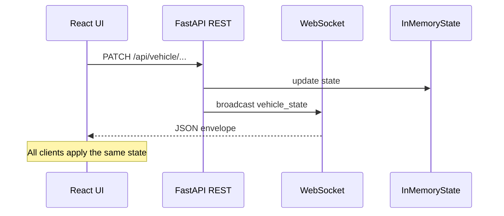

# Spectra

**Jarvis-style 3D vehicle visualization** — a split-hosted app with a React + Three.js frontend and a FastAPI backend. The UI drives vehicle lighting and paint through REST; every mutation is broadcast over WebSockets so all open tabs stay in sync with a shared in-memory state.

> **Built live, on camera, with AI — to show how modern engineers actually ship.**
 
This project was built as a take-home challenge for Applied Intuition's AI Engineering role. The goal wasn't just to build a 3D vehicle visualization tool — it was to demonstrate **AI-native development in action**: using Cursor and Claude not as autocomplete, but as a core part of the engineering workflow, narrated and recorded throughout.
 
---
 
## 🔴 Live Demo
 
| | URL |
|---|---|
| **Frontend** | [spectra-vehicle-os.vercel.app](https://spectra-vehicle-os.vercel.app) |
| **Backend API** | [spectra-vehicle-os.onrender.com](https://spectra-vehicle-os.onrender.com) |
| **API Health** | [/api/health](https://spectra-vehicle-os.onrender.com/api/health) |
 
> The backend is hosted on Render's free tier and kept alive 24/7 via **UptimeRobot** — a free uptime monitor that pings `/api/health` every 5 minutes, preventing Render's default spin-down behavior. No paid infrastructure required.
 
---
 
## 🤖 AI Coding Tool Proficiency — The Real Point of This Project
 
Most engineers say they "use AI tools." This project shows what that actually looks like.
 
The entire development was **recorded as a screenshare** with live narration — every prompt, every decision, every iteration. The recording demonstrates how I use Cursor and Claude not just to write boilerplate, but to architect, debug, and ship production-quality code fast.
 
### Cursor Tips & Tricks Used During This Build
 
These are the techniques I explicitly demonstrated and narrated in the recording:
 
- **Plan Mode first** — never jump straight into code. Use Cursor's Plan mode to architect the full feature before a single line is written. This saves massive rework.
- **New chat for new tasks** — keep context windows lean. Start fresh conversations (`Cmd+N`) for each new feature so the model isn't dragging stale context.
- **@ to reference specific files** — give Cursor surgical context by referencing exactly the files relevant to the task, not the whole codebase.
- **`.cursorrules` / `.commands` folder** — store reusable prompting conventions and project-specific rules so every new chat starts with the right context automatically.
- **`/summarize` to compress chat history** — when a conversation gets long, summarize it before continuing to keep the context window efficient.
- **Watch the context window gauge** — treat it like a fuel gauge. When it's high, start a new chat. Low context = better, more focused responses.
- **Attach images to give visual context** — screenshot the UI, paste errors, share diagrams. Visual context dramatically improves Cursor's output quality.
- **Give errors directly to Cursor** — don't paraphrase. Paste the full stack trace and let the model diagnose.
- **Go back in time** — use Cursor's conversation history to revisit earlier approaches when a direction isn't working.
- **Use the undo button** — Cursor's checkpoint system lets you revert agent changes cleanly. Use it confidently; it's not destructive.
- **Create PRs from the `.commands` file** — automate repetitive git workflows.
- **Be specific about exactly what you want** — vague prompts get vague code. Precise, contextual prompts with constraints get production-ready output.
- **Commit after every feature** — treat each working feature as a checkpoint. Small commits make rollback painless.
- **Give the app screenshot to Cursor** — when working on UI, screenshot the current state and paste it in. "Make it look more like this" with a visual is more effective than describing it in words.
- **Give as much additional context as possible** — Cursor performs best when it knows the stack, the constraints, the existing code patterns, and the end goal. Front-load that context.
 
---

## Features

- **Interactive 3D stage** — GLB vehicle loaded with React Three Fiber, cinematic lighting, tone mapping, orbit controls, and idle auto-rotate after periods without interaction.
- **Live control panel** — Headlights, brake lights, and paint selection (or cycle) with a neon / glass-morphism aesthetic.
- **Real-time sync** — WebSocket channel pushes `{ type: "vehicle_state", data: ... }` after each successful REST update; reconnect with exponential backoff.
- **Split deployment ready** — Frontend static build talks to a separate API origin via `VITE_API_BASE_URL` (or alias `VITE_API_URL`); optional `VITE_WS_URL` or auto-derived `wss://<api-host>/ws/vehicle`. CORS on the backend must allow your static origin.

## Architecture



| Layer        | Role |
| ------------ | ---- |
| **Frontend** | Vite + React 18 + TypeScript; `@react-three/fiber` + `@react-three/drei` + `three` for the scene. |
| **Backend**  | FastAPI + Uvicorn; in-memory `VehicleStore`; connection manager for WebSocket fan-out. |

## Repository layout

```text
Spectra/
├── frontend/                 # Vite React app (Vercel Root Directory → this folder)
│   ├── vercel.json           # Vite build: dist/, no nested --prefix
│   ├── .env.example          # VITE_* API / WebSocket (see Vercel section)
│   ├── public/models/         # Vehicle GLB + optional manifest JSON
│   └── src/
│       ├── api/              # REST client (vehicleClient.ts)
│       ├── hooks/            # useVehicleChannel (WebSocket)
│       ├── components/       # JarvisShell, VehicleStage, ControlPanel, …
│       ├── scene/            # VehicleModel, lighting, controls, vehicleBindings
│       └── types/            # VehicleState (keep in sync with backend schemas)
├── backend/
│   ├── .env.example          # CORS_ORIGINS
│   ├── requirements.txt      # runtime deps
│   ├── requirements-dev.txt  # GLB inspection (pygltflib)
│   ├── scripts/inspect_glb.py
│   └── app/                  # FastAPI app, state, schemas, WebSocket manager
└── cursor/Plan/scope.md      # Original design notes (checklist, risks)
```

## Prerequisites

- **Node.js** 18+ (recommended) and **npm**
- **Python** 3.11+ (or any version supported by your FastAPI/Pydantic stack)
- **Vehicle asset** — Place the GLB referenced by your manifest under `frontend/public/models/`. The checked-in manifest expects `2021_bmw_430i_xdrive_coupe_4-series.glb` (see `frontend/public/models/bmw_430i.manifest.json`). The sample `.glb` may not be in the repo; add it locally for a full run.

## Quick start (local)

Run **two** processes — this matches split production hosting.

### 1. Backend

```bash
cd backend
python -m venv .venv
source .venv/bin/activate   # Windows: .venv\Scripts\activate
pip install -r requirements.txt
cp .env.example .env        # optional; defaults often work for localhost
uvicorn app.main:app --reload --host 0.0.0.0 --port 8000
```

Health check: `GET http://localhost:8000/api/health` → `{ "status": "ok" }`.

### 2. Frontend

```bash
cd frontend
cp .env.example .env        # ensures VITE_* vars for local API
npm install
npm run dev
```

Open the URL Vite prints (default **http://localhost:5173**). The app needs both `VITE_API_BASE_URL` and `VITE_WS_URL` set; otherwise the REST client or WebSocket hook will error at runtime.

### npm scripts (frontend)

| Command | Description |
| ------- | ----------- |
| `npm run dev` | Vite dev server |
| `npm run build` | Typecheck + production bundle |
| `npm run preview` | Serve the production build locally |
| `npm run typecheck` | `tsc --noEmit` only |

## Configuration

### Frontend (`frontend/.env`)

| Variable | Description |
| -------- | ----------- |
| `VITE_API_BASE_URL` | REST origin, **no trailing slash** (e.g. `http://localhost:8000`). Required at build time unless you set `VITE_API_URL`. |
| `VITE_API_URL` | **Alias** for `VITE_API_BASE_URL` (e.g. single env var on Vercel named `VITE_API_URL`). |
| `VITE_WS_URL` | Optional. Full WebSocket URL (e.g. `wss://api.example.com/ws/vehicle`). If omitted, the app uses `wss://<same host as API>/ws/vehicle` derived from the API origin (or `ws://` for `http://` APIs). |

Copy from `frontend/.env.example`. Vite inlines `VITE_*` at **build** time — change production URLs, then **rebuild** (or trigger a new Vercel deployment).

### Backend (`backend/.env` or shell env)

| Variable | Description |
| -------- | ----------- |
| `CORS_ORIGINS` | Comma-separated **frontend** origins (e.g. your Vercel URL), not the API host. Default: local Vite origins. No trailing slashes. |
| `CORS_ORIGIN_REGEX` | Optional. Regex for extra origins (e.g. `https://.*\.vercel\.app` so Preview deploys work without listing each URL). |

Copy from `backend/.env.example`.

### Single-worker requirement

Vehicle state is **in-memory**. Use **one** Uvicorn worker (or one replica without a shared store). Multiple workers or replicas each hold separate state unless you replace the store with Redis or similar and synchronize broadcasts.

## HTTP API

Base URL: your API origin + paths below (e.g. `http://localhost:8000`).

| Method | Path | Description |
| ------ | ---- | ----------- |
| `GET` | `/api/health` | Liveness / monitoring |
| `GET` | `/api/vehicle` | Current `VehicleState` |
| `PATCH` | `/api/vehicle/headlights` | Body: `{ "on": boolean }` |
| `PATCH` | `/api/vehicle/brake-lights` | Body: `{ "on": boolean }` |
| `PATCH` | `/api/vehicle/paint` | Body: `{ "index": number }` — index must be within the backend paint palette range (currently `0..3`, four colors) |
| `POST` | `/api/vehicle/paint/cycle` | Advance paint index modulo palette length |

Successful mutating responses return the updated `VehicleState` and trigger a WebSocket broadcast.

### `VehicleState` shape

```json
{
  "headlights_on": false,
  "brake_lights_on": false,
  "paint_index": 0
}
```

Frontend TypeScript mirrors this in `frontend/src/types/vehicle.ts`; backend models live in `backend/app/schemas.py`.

## WebSocket

- **URL:** `/ws/vehicle` on the API host (e.g. `ws://localhost:8000/ws/vehicle`).
- **Server behavior:** On connect, the server sends the current state as JSON; clients may send text (e.g. keep-alive pings); disconnect is handled gracefully.
- **Message envelope:**

```json
{
  "type": "vehicle_state",
  "data": {
    "headlights_on": false,
    "brake_lights_on": false,
    "paint_index": 0
  }
}
```

The React hook `useVehicleChannel` parses this shape and reconnects with backoff on failures.

## 3D asset and bindings

- **Model path** — Served from `frontend/public/models/` so Vite copies files as static assets.
- **`vehicleBindings.ts`** — Maps mesh names / patterns to headlights, brake lights, and paint-capable body meshes.
- **`bmw_430i.manifest.json`** — Optional curated list of mesh names and paint labels from a GLB inspection pass.
- **Inspecting a GLB** — With dev dependencies: `pip install -r backend/requirements-dev.txt`, then e.g. `python backend/scripts/inspect_glb.py path/to/model.glb` to list meshes and materials for updating bindings.

Commercial GLBs often have inconsistent naming; adjust bindings or the manifest after inspection if materials do not respond as expected.

## Production deployment (split host)

1. Deploy the **backend** with Uvicorn (or a process manager) on a reachable **HTTPS** URL (e.g. [Railway](https://railway.app), Fly.io, a VPS). Set `CORS_ORIGINS` to include your **Vercel site origin** exactly (no path), e.g. `https://spectra-xyz.vercel.app`. Ensure the host/proxy allows **WebSocket upgrades** (`Upgrade: websocket`) — otherwise REST may work while the live state stream fails.
2. Build the frontend with production `VITE_*` values (see below). Deploy the `frontend/dist` output (Vercel does this automatically when connected to Git).
3. Keep **one worker** per logical state store unless you introduce shared persistence / pub-sub.

### Deploying the frontend on Vercel

Vercel only hosts the **static** Vite build. Your FastAPI app must already be live on another URL; the browser will call that URL for REST and WebSocket.

#### Checklist: Vercel (frontend) + Render (API)

**Recommended: same-origin REST (proxy)** — avoids browser CORS and many extensions that block cross-site requests to `onrender.com` while still allowing `wss://` to Render.

1. **[`frontend/vercel.json`](frontend/vercel.json)** — `rewrites` send `/api/:path*` to your Render service. Update the `destination` host if your Render URL changes.
2. **Vercel → Environment Variables** (then redeploy):  
   - **Delete** `VITE_API_BASE_URL` (and `VITE_API_URL`) so the app uses relative `/api/...` on your Vercel domain.  
   - **Keep** `VITE_WS_URL=wss://YOUR-SERVICE.onrender.com/ws/vehicle`  
   - **Remove** `CORS_ORIGINS` from Vercel — it does nothing for the browser and belongs only on the backend.
3. **Render → Environment**: keep `CORS_ORIGINS=https://your-app.vercel.app` (no trailing slash) so the **WebSocket** handshake from the Vercel origin is allowed. Optional: `CORS_ORIGIN_REGEX=https://.*\.vercel\.app` for previews.

**Alternative: direct REST to Render** — set `VITE_API_BASE_URL=https://your-service.onrender.com` and do **not** rely on `/api` rewrites; you must get CORS perfect on Render (and watch for blockers). Trailing slashes on env values are stripped in app code, but use clean values in dashboards anyway.

If **WS** works but **REST ERR** persists with direct mode, try **proxy mode** (step 1–2) or test in a clean profile without ad blockers.

#### Environment variables on Vercel

Add **at least one** of these in the Vercel project → **Settings** → **Environment Variables** (apply to *Production* and *Preview* as needed):

- **`VITE_API_BASE_URL`** — public API origin, no trailing slash, e.g. `https://your-service.up.railway.app`
- **or `VITE_API_URL`** — same value; use whichever naming you prefer (the code treats it as an alias for the REST base).

Optional:

- **`VITE_WS_URL`** — only if the WebSocket is **not** at `wss://<same host as API>/ws/vehicle`. Otherwise omit it; the app will derive `wss://` from an `https://` API base automatically.

**Important:** `VITE_*` variables are read when `npm run build` runs. After changing them in Vercel, trigger **Redeploy** so the new bundle is produced.

#### Option A — Git integration (recommended)

1. Push this repo to GitHub (or GitLab / Bitbucket).
2. In [Vercel](https://vercel.com), **Add New… → Project**, import the repository.
3. Under **Settings → General → Root Directory**, set **`frontend`**. The app’s [`frontend/vercel.json`](frontend/vercel.json) runs `npm install` / `npm run build` there and publishes **`dist`**. (Do **not** combine Root Directory `frontend` with an install command like `npm install --prefix ./frontend` — that looks for `frontend/frontend/package.json` and fails.)
4. Add the environment variables above, then deploy.
5. Copy the deployment URL (e.g. `https://spectra-xxx.vercel.app`) and append it to **`CORS_ORIGINS`** on the backend; redeploy the API if needed.

#### Option B — Drag and drop `dist/`

1. On your machine, point the build at your real API (HTTPS), then build:

   ```bash
   cd frontend
   export VITE_API_BASE_URL=https://your-api.example.com
   # optional: export VITE_WS_URL=wss://...
   npm ci && npm run build
   ```

2. Open Vercel → **Add New… → Project** (or the dashboard area for static uploads) and **drag the `frontend/dist` folder** onto the upload target.
3. You get a URL immediately. You must **rebuild locally** with the correct `VITE_*` values whenever the API URL changes (drag-and-drop does not run Vercel’s env UI for that folder).

#### Mixed content and WebSockets

- Pages on `https://…` must call an **`https://`** API and a **`wss://`** WebSocket. If the UI loads over HTTPS but the bundle still points at `http://localhost:8000`, the browser will block requests or the socket.
- If the WebSocket fails while REST works, check proxy/WebSocket upgrade support on the API host.

#### Deploying from the repo root (no Root Directory)

If you leave Root Directory empty, add a root `vercel.json` with `installCommand` / `buildCommand` using `npm install --prefix ./frontend` and `outputDirectory: "frontend/dist"`. The supported setup in this repo is **Root Directory = `frontend`** plus [`frontend/vercel.json`](frontend/vercel.json).

## Troubleshooting

| Symptom | Things to check |
| ------- | ---------------- |
| Frontend throws about API / WebSocket env | Set `VITE_API_BASE_URL` or `VITE_API_URL`; optionally `VITE_WS_URL`. Locally: `frontend/.env`. On Vercel: Project → Environment Variables, then redeploy. |
| REST works but WebSocket never connects | Wrong explicit `VITE_WS_URL`, firewall, or proxy blocking Upgrade; for HTTPS sites use `https://` API base so `wss://` can be derived, or set `VITE_WS_URL` to a working `wss://` URL. |
| CORS errors on fetch (`REST ERR` on Vercel) | On **Render**, set `CORS_ORIGINS` to your **Vercel site origin** (copy from the browser: `https://your-project.vercel.app` — no path, no trailing slash). Do **not** put your Render API URL there. Optional: `CORS_ORIGIN_REGEX=https://.*\.vercel\.app` for previews. Redeploy the API after changing env. |
| Paint or lights look wrong | Mesh names changed in the GLB; re-run `inspect_glb.py` and update `vehicleBindings.ts` / manifest. |
| State differs per tab after toggle | Multiple backend workers or instances; use a single worker or externalize state. |

## Further reading

Design goals, phased checklist, and risks are summarized in [`cursor/Plan/scope.md`](cursor/Plan/scope.md).
