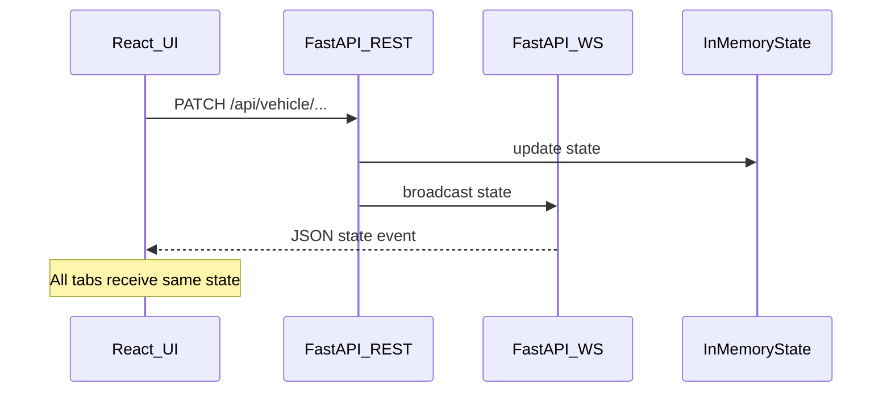

# Jarvis-style 3D vehicle visualization (Spectra)

**Overview:** Greenfield monorepo under Spectra with a Vite+React+Three.js frontend (split-hosted) and a FastAPI backend using in-memory state, REST mutations that broadcast over WebSockets, and a Jarvis-style control panel synced to the 3D scene.

## Implementation checklist

- [x] **Phase 0 — Asset (Completed):** Copy GLB to `frontend/public/models`; inspect mesh/material names; draft `vehicleBindings` + optional manifest JSON
- [x] **Phase 1 — Backend (Completed):** FastAPI: in-memory state, REST mutations, WS broadcast, CORS from env, health route
- [x] **Phase 2 — Frontend foundation (Completed):** Vite+React+TS: Jarvis theme CSS, REST client, WebSocket hook with reconnect
- [x] **Phase 3 — R3F scene (Completed):** GLTF load, cinematic lights/tone mapping, OrbitControls + idle auto-rotate
- [x] **Phase 4 — Visual state (Completed):** Bind headlights/brake/paint to materials and optional auxiliary lights
- [x] **Phase 5 — Panel (Completed):** ControlPanel with glow toggles, live state from WS, REST on user action
- [ ] **Phase 6 — Split deploy:** Env examples: `VITE_API_BASE_URL`, `VITE_WS_URL`, `CORS_ORIGINS`; document `wss` + single-worker constraint

---

## Current workspace

- Model at repo root: `2021_bmw_430i_xdrive_coupe_4-series.glb` (~10 MB).
- No `frontend/` or `backend/` yet; treat as greenfield next to the model.

## Hosting choice (split)

- **Frontend:** static host (Vite build output). **Backend:** separate FastAPI origin.
- **Implications** (must be explicit in implementation):
  - FastAPI **CORS:** allow the frontend origin(s), methods, headers; allow **credentials** only if you add cookies later (default: no credentials + simple headers).
  - Frontend **env:** `VITE_API_BASE_URL` (e.g. `https://api.example.com`), `VITE_WS_URL` (e.g. `wss://api.example.com/ws/vehicle` or derived from base with a documented rule). Using **two vars** avoids ambiguity when API path prefix differs from WS path.
  - **WebSockets:** use `wss://` in production; local dev typically `ws://localhost:8000/...`.
  - **CORS + WebSocket:** browsers do not use CORS preflight for WebSocket the same way as XHR; still configure allowed **origins** on the server if using middleware that checks `Origin`, and ensure proxies (e.g. Cloudflare, ALB) support WebSocket upgrades.



---

## Target directory layout

```text
Spectra/
├── 2021_bmw_430i_xdrive_coupe_4-series.glb   # keep or relocate (see Phase 1)
├── frontend/
│   ├── package.json
│   ├── vite.config.ts
│   ├── tsconfig.json
│   ├── index.html
│   ├── .env.example                            # VITE_API_BASE_URL, VITE_WS_URL
│   ├── public/
│   │   └── models/
│   │       └── 2021_bmw_430i_xdrive_coupe_4-series.glb
│   └── src/
│       ├── main.tsx
│       ├── App.tsx
│       ├── index.css                            # global Jarvis theme tokens
│       ├── types/
│       │   └── vehicle.ts                      # shared TS types mirroring API
│       ├── api/
│       │   └── vehicleClient.ts                # fetch wrappers for REST
│       ├── hooks/
│       │   └── useVehicleChannel.ts            # WebSocket + reconnect + latest state
│       ├── components/
│       │   ├── layout/
│       │   │   └── JarvisShell.tsx             # full-viewport chrome, scanlines optional
│       │   ├── ui/
│       │   │   └── GlowToggle.tsx
│       │   ├── ControlPanel.tsx                # toggles + live state readout
│       │   └── VehicleStage.tsx                # Canvas + R3F scene wiring
│       └── scene/
│           ├── VehicleModel.tsx                # GLTF load, mesh traversal
│           ├── lighting.tsx                    # key/fill/rim + environment
│           ├── controls.tsx                    # OrbitControls + idle spin
│           └── vehicleBindings.ts              # mesh name → behavior (lights/paint)
└── backend/
    ├── requirements.txt                        # fastapi, uvicorn[standard], websockets (or starlette built-in)
    ├── .env.example                            # CORS_ORIGINS (comma-separated)
    └── app/
        ├── __init__.py
        ├── main.py                             # app factory, CORS, router mounts
        ├── config.py                           # settings from env
        ├── state.py                            # thread-safe in-memory VehicleState
        ├── schemas.py                          # Pydantic request/response
        ├── broadcaster.py                      # connection registry + broadcast helper
        ├── routers/
        │   ├── vehicle.py                      # REST endpoints
        │   └── ws_vehicle.py                   # WebSocket endpoint
        └── __main__.py                         # optional: uvicorn entry
```

No extra markdown files unless you request them; `.env.example` is configuration, not prose docs.

---

## Data model (in-memory)

Single authoritative object, e.g.:

- `headlights_on: bool`
- `brake_lights_on: bool`
- `paint_index: int` (0..n-1 for palette)
- Optional: `vehicle_id` or `model_key` later if you add multiple `.glb` files

**Concurrency:** use a small async lock or a plain dict updated in FastAPI route handlers (single worker). Document that **multi-worker** deployments need Redis or sticky sessions + external pubsub; for “in-memory” scope, run **one** Uvicorn worker unless you add a store.

**WebSocket payload:** one JSON shape for all clients, e.g. `{ "type": "vehicle_state", "data": { ... } }` so you can extend later (errors, pings).

---

## REST API (mutations trigger broadcast)

Suggested routes (prefix `/api`):

| Method | Path                        | Body             | Behavior                             |
| ------ | --------------------------- | ---------------- | ------------------------------------ |
| GET    | `/api/vehicle/state`        | —                | Return current state                 |
| PATCH  | `/api/vehicle/headlights`   | `{ "on": true }` | Set headlights, broadcast            |
| PATCH  | `/api/vehicle/brake-lights` | `{ "on": true }` | Set brake lights, broadcast          |
| PATCH  | `/api/vehicle/paint`        | `{ "index": 2 }` | Set paint by index, broadcast        |
| POST   | `/api/vehicle/paint/cycle`  | —                | `index = (index + 1) % n`, broadcast |

After every successful mutation: **persist to in-memory store**, then **broadcast** to all connected WebSocket clients.

**Note:** UI should call REST for actions; it should **apply** updates when the WS message arrives (or on GET after error) so all tabs stay consistent with the “REST is the write path” rule.

---

## Frontend: Three.js / React Three Fiber

- **Stack:** React 18 + Vite + `@react-three/fiber` + `@react-three/drei` (helpers: `useGLTF`, `Environment`, `OrbitControls` wrapper). Still uses **GLTFLoader** under the hood via `useGLTF`.
- **Model path:** serve from `public/models/...glb` so Vite copies as-is; copy the root GLB into `frontend/public/models/` during implementation.
- **OrbitControls:** enable rotate, pan, zoom; `enableDamping` for premium feel.
- **Idle auto-rotate:** e.g. `autoRotate` on controls when **no pointer interaction** for ~2–3s; on `pointerdown` / `wheel` / `touchstart`, disable auto-rotate until idle again. Implement via small hook listening to control events and a timeout ref.
- **Lighting:** `Environment` (HDR optional — can ship without external HDRI first using `drei` presets or manual hemisphere + directional + subtle point accents), strong **tonemapping** and **ACESFilmic** in `gl` options for cinematic look, slight fog optional.
- **Theme UI:** deep near-black background with navy tint (`#050810`–`#0a1020`), cyan/magenta or electric blue neon accents, thin geometric frames, subtle grid/backdrop in CSS (no heavy post-processing required for v1).

---

## Binding lights and paint to the BMW GLB

**Reality check:** commercial car `.glb` files rarely use consistent mesh names. Phase 0 in implementation should **inspect** the asset:

- Log `mesh.name` and material names after load (one-time dev overlay or console in `VehicleModel.tsx`).
- Introduce `frontend/src/scene/vehicleBindings.ts` mapping:
  - **Brake lights:** mesh name(s) or wildcard patterns → raise `emissive` red, maybe small **point light** near rear for bloom-like glow (if you skip EffectComposer, emissive + tone mapping still reads well).
  - **Headlights:** mesh/glass names → warm white emissive + **spotlights** or rect area lights aimed forward (start with emissive-only if mesh split is unclear).
  - **Paint:** identify **body** meshes (exclude glass, interior, wheels if you want wheels unchanged v1); store original materials; swap `color` / duplicate materials per body part from a **palette** array in TS (black, metallic blue, pearl white, etc.).

If names are unusable, fallback: maintain a **JSON manifest** checked into `public/models/bmw_430i.manifest.json` listing mesh names you confirm by hand after one inspection session.

---

## Control panel

- Placement: **right dock** or **bottom bar** with glass-morphism panel (CSS `backdrop-filter`), neon outline, monospaced status readout.
- **GlowToggle** components call REST endpoints; disable while request in flight; show error toast/text on failure.
- **Live state:** driven by `useVehicleChannel` (WS). Display raw booleans + paint name from palette label.

---

## Phased delivery

### Phase 0 — Asset and contract

- Copy GLB to `frontend/public/models/`.
- Define Pydantic schemas + TS types to match.
- Inspect GLB mesh/material names; draft `vehicleBindings` (iterate until brake/head/paint behave).

### Phase 1 — Backend core (completed)

- FastAPI app with CORS from `CORS_ORIGINS`.
- In-memory state + REST routes + WebSocket endpoint.
- Connection manager: `set` of active connections, `broadcast_json` on mutation.
- Health: `GET /api/health` for static hosts / static monitors.

### Phase 2 — Frontend foundation

- Vite React TS scaffold, global Jarvis theme CSS variables.
- `useVehicleChannel`: connect, reconnect with backoff, parse `vehicle_state`.
- `vehicleClient`: typed `fetch` to `VITE_API_BASE_URL`.

### Phase 3 — 3D stage

- `VehicleStage` + `VehicleModel` load GLB, default camera framing (`Bounds` from drei or manual `fit`).
- Lighting + tone mapping + OrbitControls + idle auto-rotate behavior.

### Phase 4 — Visual controls (completed)

- Wire state to materials/lights per bindings; smooth transitions optional (`lerp` emissive intensity in `useFrame`).

### Phase 5 — Control panel + E2E manual test (completed)

- Panel toggles → REST → WS → scene + readout.
- Open two browser tabs: toggle in one, verify the other updates.

### Phase 6 — Split deploy hardening

- Production env examples, `wss` URL, single-worker note for in-memory state.
- Optional: simple proxy snippet (if API behind same domain path in future) — only if you pivot; split hosting means keep CORS list explicit.

---

## Risks and decisions

- **Mesh discovery** is the main schedule risk; plan assumes one iteration after loading the real BMW GLB.
- **In-memory state** lost on restart; acceptable per spec.
- **No tests** in this plan unless you ask; add later (pytest for API, Playwright optional).

---

## Local development (implementer reference)

- Backend: `uvicorn app.main:app --reload --port 8000` from `backend/` (exact module path finalized in code).
- Frontend: `npm run dev` from `frontend/` with `.env` pointing at local API.

This keeps **two dev servers** for split hosting, matching production mental model.
